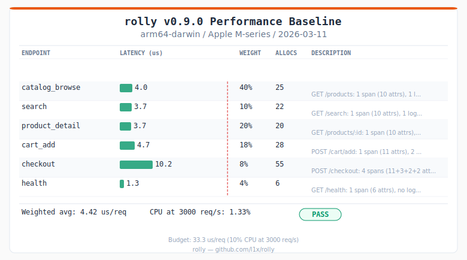

# rolly

Lightweight Rust observability. Hand-rolled OTLP protobuf over HTTP, built on [tracing](https://docs.rs/tracing).

## Core and middleware

rolly has two layers:

**Generic core** — works with any Rust application, not just HTTP servers:
- Custom `tracing::Layer` that captures all spans and events
- Encodes them as OTLP protobuf (`ExportTraceServiceRequest`, `ExportLogsServiceRequest`)
- Ships via HTTP POST to any OTLP-compatible collector (Vector, Grafana Alloy, OTEL Collector)
- Dual output: OTLP HTTP primary + JSON stderr fallback (local dev / CloudWatch)
- Background exporter with batching (512 items / 1s window), concurrent workers, and 3-retry exponential backoff — telemetry never blocks your application
- Probabilistic head-based trace sampling — deterministic based on trace_id, so the same trace gets the same decision across services
- Native OTLP metrics with Counter, Gauge, and Histogram instruments, client-side aggregation, and `ExportMetricsServiceRequest` export
- Automatic exemplar capture — metric data points are annotated with trace_id + span_id from the active span, enabling drill-down from metric spikes to traces
- Process metrics (CPU, memory) via `/proc` polling on Linux

**HTTP middleware** (optional, `tower` feature) — framework-specific request instrumentation:
- Tower middleware for Axum
- Extracts request IDs (CloudFront, `x-request-id`, or any header), generates deterministic trace IDs via BLAKE3
- Creates request spans with method, path, status, latency
- Emits RED metrics (request duration, count, errors)
- W3C `traceparent` propagation for outbound requests

Any `tracing` span or event from anywhere in your application — HTTP handlers, background tasks, queue consumers, batch jobs — flows through the same OTLP export pipeline.

## Signals

| Signal  | Format                         | Standard |
|---------|--------------------------------|----------|
| Traces  | OTLP `ExportTraceServiceRequest` protobuf | Yes |
| Logs    | OTLP `ExportLogsServiceRequest` protobuf  | Yes |
| Metrics | OTLP `ExportMetricsServiceRequest` protobuf | Yes |

All three signals follow the [OTLP specification](https://opentelemetry.io/docs/specs/otlp/) and are encoded as native protobuf. Any OTLP-compatible backend can ingest them directly.

### Metrics

rolly provides Counter, Gauge, and Histogram instruments with client-side aggregation. Metrics are accumulated in-process and flushed as `ExportMetricsServiceRequest` on a configurable interval (default 10s).

```rust
use rolly::{counter, gauge, histogram};

// Counters are monotonic and cumulative
let req_counter = counter("http.server.requests", "Total HTTP requests");
req_counter.add(1, &[("method", "GET"), ("status", "200")]);

// Gauges record last-value
let mem_gauge = gauge("process.memory.usage", "Memory usage in bytes");
mem_gauge.set(1_048_576.0, &[("unit", "bytes")]);

// Histograms with configurable bucket boundaries
let latency = histogram(
    "http.server.duration",
    "Request latency in seconds",
    &[0.005, 0.01, 0.025, 0.05, 0.1, 0.25, 0.5, 1.0, 2.5, 5.0, 10.0],
);
latency.observe(0.042, &[("method", "GET"), ("route", "/api/users")]);
```

Attribute order does not matter — `[("a", "1"), ("b", "2")]` and `[("b", "2"), ("a", "1")]` aggregate to the same data point.

When called inside a tracing span, metric recordings automatically capture an **exemplar** with the current `trace_id` and `span_id`. This lets you click from a latency spike on a dashboard straight to the offending trace — no configuration needed.

## Usage

```rust
use rolly::{init, TelemetryConfig};
use std::time::Duration;

let _guard = init(TelemetryConfig {
    service_name: "my-service".into(),
    service_version: env!("CARGO_PKG_VERSION").into(),
    environment: "prod".into(),
    otlp_traces_endpoint: Some("http://vector:4318".into()),
    otlp_logs_endpoint: Some("http://vector:4318".into()),
    otlp_metrics_endpoint: Some("http://vector:4318".into()),
    log_to_stderr: true,
    use_metrics_interval: Some(Duration::from_secs(30)),
    metrics_flush_interval: None, // default 10s
    sampling_rate: Some(0.1),    // export 10% of traces
    backpressure_strategy: rolly::BackpressureStrategy::Drop,
});

// All tracing spans/events are now exported as OTLP protobuf
tracing::info_span!("process_job", job_id = 42).in_scope(|| {
    tracing::info!("job completed");
});
```

Endpoints can be configured independently — send traces to Jaeger, logs to Vector, and metrics to a different collector:

```rust
let _guard = init(TelemetryConfig {
    service_name: "my-service".into(),
    service_version: env!("CARGO_PKG_VERSION").into(),
    environment: "prod".into(),
    otlp_traces_endpoint: Some("http://jaeger:4318".into()),
    otlp_logs_endpoint: Some("http://vector:4318".into()),
    otlp_metrics_endpoint: Some("http://prometheus-gateway:4318".into()),
    log_to_stderr: false,
    use_metrics_interval: None,
    metrics_flush_interval: Some(Duration::from_secs(15)),
    sampling_rate: Some(0.01), // export 1% of traces
    backpressure_strategy: rolly::BackpressureStrategy::Drop,
});
```

Set any endpoint to `None` to disable that signal. Set `sampling_rate` to `None` or `Some(1.0)` to export all traces (default).

### Sampling

Trace sampling reduces export volume at high scale. The decision is **deterministic based on trace_id** — the same trace always gets the same decision, so sampling is consistent across services sharing a trace.

- `Some(1.0)` or `None` — export all traces (default)
- `Some(0.1)` — export 10% of traces
- `Some(0.01)` — export 1% of traces
- `Some(0.0)` — export no traces

Child spans and log events within a sampled-out trace are also suppressed. Metrics are never sampled — counters and gauges always reflect the full traffic.

### HTTP middleware (Axum/Tower)

The `tower` feature is enabled by default.

```rust
let app = axum::Router::new()
    .route("/health", axum::routing::get(health))
    .layer(rolly::request_layer())       // inbound: request spans + RED metrics
    .layer(rolly::propagation_layer());  // outbound: W3C traceparent injection
```

To disable Tower middleware (e.g. for non-HTTP applications):

```toml
[dependencies]
rolly = { version = "0.9", default-features = false }
```

## Pipeline

```
Application (tracing) → rolly (protobuf) → HTTP POST → Vector/Collector (OTLP) → storage
```

## Why not OpenTelemetry SDK?

- Version lock-step across `opentelemetry-*` crates
- ~120 transitive dependencies, 3+ minute compile times
- Shutdown footgun (`drop()` doesn't flush)
- gRPC bloat from `tonic`/`prost`

rolly hand-rolls the protobuf wire format (~200 lines). The format has been stable since 2008.

## Dependencies

7 direct dependencies. No `opentelemetry`, `tonic`, or `prost`.

## Performance

rolly targets <10% CPU overhead at 3000 req/s on ARM64.



Benchmarks simulate realistic e-commerce API traffic. See [benches/baseline.toml](benches/baseline.toml) for raw numbers.

## Changelog

### v0.9.0
- Configurable `BackpressureStrategy` enum (currently `Drop`; extensible)
- End-to-end tests with Vector (OTLP HTTP → JSON file assertions)
- 19 Kani proof harnesses, 2 TLA+ specs, 9 proptests, 3 fuzz targets

### v0.5.0
- Histogram instrument with configurable bucket boundaries
- Automatic exemplar capture (trace_id + span_id on metric data points)
- `TelemetryConfig` accepts `String` fields

### v0.4.0
- Deterministic head-based trace sampling (consistent by trace_id across services)

### v0.3.0
- Native OTLP metrics: Counter and Gauge with client-side aggregation
- `ExportMetricsServiceRequest` protobuf encoding and HTTP export

### v0.2.0
- Independent trace and log export configuration (separate endpoints)

### v0.1.3
- Generic request ID support (any header, not just CloudFront)

## License

MIT OR Apache-2.0
