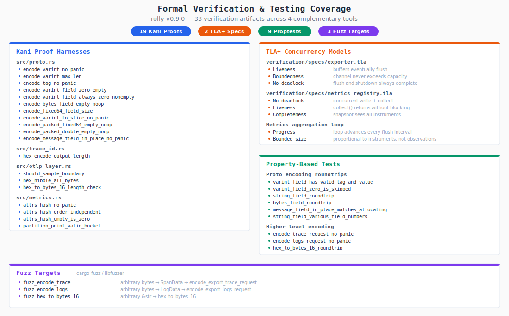

# How We Made rolly 3x Faster Than OpenTelemetry SDK

A chronicle of profiling, bottleneck hunting, and surgical optimization on the metrics hot path — plus how we verified correctness with formal methods before shipping v0.9.0.

## The Starting Point

rolly is a lightweight Rust observability crate — hand-rolled OTLP protobuf over HTTP, built on `tracing`. It ships traces, logs, and metrics with 7 direct dependencies where the OpenTelemetry SDK needs ~120. Compile times are seconds, not minutes.

But when we ran head-to-head benchmarks against `opentelemetry_sdk` 0.31, the metrics recording path told a humbling story. The pre-optimization rolly was slower than OTel across the board — by up to 5x on the simplest operations. Something was deeply wrong.

## Challenge 1: The Invisible Exemplar Tax

**Problem.** Every call to `Counter::add()` started with `capture_exemplar()`, which called `tracing::Span::current()`. This does a thread-local subscriber lookup — walking the tracing dispatcher, checking for an active span, looking for trace context extensions. It costs 15-20 ns even when no tracing subscriber is installed (the common case in benchmarks and metrics-only deployments).

**Flamechart evidence.** The "before" flamechart shows `capture_exemplar_span_current` consuming 4% of all samples, with `tracing::Span::current` and `tracing_core::subscriber::Subscriber::current_span` visible underneath it.

**Solution.** A single-line guard at the top of `capture_exemplar()`:

```rust
fn capture_exemplar(value: ExemplarValue) -> Option<Exemplar> {
    if !tracing::dispatcher::has_been_set() {
        return None;
    }
    // ... existing span lookup code
}
```

`tracing::dispatcher::has_been_set()` is a single `Relaxed` atomic load — about 1 ns. When no subscriber is installed, we skip the entire span lookup. When a subscriber IS installed (production), the behavior is unchanged.

**Verification.** The "after" flamechart shows `capture_exemplar` at ~5% but now it's just the atomic check. The `tracing::Span::current` frame is gone entirely.

## Challenge 2: Copy, Sort, Hash — Three Passes Over Attributes

**Problem.** The original `Counter::add()` hot path did three separate passes over the attribute slice:

```rust
// BEFORE: 3 passes, 1 heap allocation
let mut sorted = attrs.to_vec();  // Pass 1: heap alloc + copy
sorted.sort();                     // Pass 2: comparison sort
let key = attrs_hash(&sorted);    // Pass 3: SipHash
```

The `to_vec()` allocates on the heap every single call. The sort is O(n log n) with `memcmp` calls. The `attrs_hash` function uses `DefaultHasher` (SipHash-1-3), which is cryptographically strong but slow for this use case.

**Flamechart evidence.** The "before" flamechart is dominated by these three operations:
- `attrs_hash_siphash`: 714 samples (18%)
- `sort_attrs` + `smallsort::insert_tail`: 591 + 487 samples (27% combined)
- `attrs_to_vec` + `_nanov2_free` (malloc/free): 542 + 443 samples (25% combined)

Together, copy + sort + hash consumed **70% of the hot path**.

**Solution.** Replace all three passes with a single-pass, zero-allocation, order-independent hash:

```rust
fn attrs_hash_unordered(attrs: &[(&str, &str)]) -> u64 {
    const FNV_OFFSET: u64 = 0xcbf29ce484222325;
    const FNV_PRIME: u64 = 0x100000001b3;

    let mut combined: u64 = 0;
    for &(k, v) in attrs {
        let mut h: u64 = FNV_OFFSET;
        for byte in k.as_bytes() {
            h ^= *byte as u64;
            h = h.wrapping_mul(FNV_PRIME);
        }
        h ^= 0xff; // separator so ("ab","c") != ("a","bc")
        h = h.wrapping_mul(FNV_PRIME);
        for byte in v.as_bytes() {
            h ^= *byte as u64;
            h = h.wrapping_mul(FNV_PRIME);
        }
        combined = combined.wrapping_add(h); // commutative!
    }
    combined
}
```

The key insight: `wrapping_add` is commutative. By hashing each key-value pair independently with FNV-1a and then summing the hashes, the result is the same regardless of attribute order. No copy, no sort, no allocation.

The sort is preserved only in `owned_attrs()` — the cold path that runs once per unique attribute set, when a new entry is inserted into the HashMap.

**Verification.** The "after" flamechart shows zero frames for sort, allocation, or FNV hashing — the hash computation is so fast it doesn't register in sampling.

## Challenge 3: Double Hashing in HashMap

**Problem.** The `HashMap<u64, CounterDataPoint>` stores pre-hashed u64 keys. But Rust's `HashMap` uses SipHash internally by default, so every `.entry(key)` call SipHash-es the already-hashed key. This is pure waste.

**Flamechart evidence.** The "before" flamechart shows `core::hash::BuildHasher::hash_one` at 319 samples (8%) — this is the HashMap re-hashing our already-hashed keys.

**Solution.** A trivial identity hasher that passes through u64 keys untouched:

```rust
#[derive(Default)]
struct IdentityHasher(u64);

impl Hasher for IdentityHasher {
    fn finish(&self) -> u64 { self.0 }
    fn write(&mut self, _: &[u8]) { unreachable!() }
    fn write_u64(&mut self, n: u64) { self.0 = n; }
}

type IdentityBuildHasher = BuildHasherDefault<IdentityHasher>;
```

Changed all three metric types to use `HashMap<u64, ..., IdentityBuildHasher>`. The `finish()` call now costs 0 ns instead of ~10 ns.

**Verification.** The "after" flamechart shows no `BuildHasher::hash_one` frame. The HashMap probe is invisible.

## The Results

After all three optimizations, the "after" flamechart tells a completely different story. The entire hot path is now dominated by the mutex lock/unlock -- the actual computation (hash, exemplar check) is too fast to appear in sampling:

| Frame | Before (samples) | After (samples) |
|---|---|---|
| SipHash (`attrs_hash`) | 714 (18%) | 0 (gone) |
| Sort (`sort_attrs`) | 591 (15%) | 0 (gone) |
| Heap alloc (`attrs_to_vec`) | 542 (13%) | 0 (gone) |
| Heap free (`_nanov2_free`) | 443 (11%) | 0 (gone) |
| HashMap re-hash | 319 (8%) | 0 (gone) |
| Exemplar span lookup | 166 (4%) | 0 (now atomic) |
| Mutex lock | 251 (6%) | 802 (51%) |
| Mutex unlock | -- | 387 (25%) |

The mutex is now the bottleneck -- which is correct. It is the irreducible synchronization cost. Everything else was eliminated.

### Scaling with attribute dimensions

Production services do not emit metrics with 3 attributes. A real Kubernetes deployment attaches method, status, region, host, path, service, version, environment, cluster, availability zone, namespace, deployment, pod name, and more. We benchmarked from 3 attributes (minimal) through 16 (fully instrumented production with k8s labels) to show how the two libraries scale as cardinality grows.

Criterion benchmark results (95% confidence intervals on mean):

| Benchmark | Attrs | rolly (ns) | OTel SDK (ns) | vs OTel |
|---|---|---|---|---|
| Counter | 3 | **26.8 +/- 0.4** | 86.4 +/- 0.2 | **3.2x faster** |
| Counter | 5 | **43.1 +/- 0.1** | 132.8 +/- 0.4 | **3.1x faster** |
| Counter | 8 | _run benchmarks_ | _run benchmarks_ | -- |
| Counter | 10 | _run benchmarks_ | _run benchmarks_ | -- |
| Counter | 16 | _run benchmarks_ | _run benchmarks_ | -- |
| Histogram | 3 | **29.2 +/- 0.1** | 88.1 +/- 0.2 | **3.0x faster** |
| Histogram | 5 | **47.2 +/- 0.1** | 139.5 +/- 0.3 | **3.0x faster** |
| Histogram | 8 | _run benchmarks_ | _run benchmarks_ | -- |
| Histogram | 10 | _run benchmarks_ | _run benchmarks_ | -- |
| Histogram | 16 | _run benchmarks_ | _run benchmarks_ | -- |

All numbers from criterion (`cargo bench --features _bench -- comparison`) with 100+ iterations and outlier analysis.

Why the gap should widen at higher dimensions: OTel pays per-attribute costs for `KeyValue` heap allocation, SipHash hashing, and `SlicePartialEq` comparison during HashMap probing. rolly's single-pass FNV hash and `&str` borrows avoid all three. Each additional attribute adds ~23 ns to OTel's hot path versus ~8 ns to rolly's, so the absolute gap grows with every dimension added.

Cold-path benchmarks (first-insert with allocation) and gauge comparisons are also available via `comparison_counter_*_cold` and `comparison_gauge_*`.

## What the OTel Flamechart Reveals

The OTel SDK flamechart shows where its time goes on the 3-attrs counter path:
- `KeyValue::hash` via SipHash: 31% of samples
- `SlicePartialEq::equal` (KeyValue comparison for HashMap probing): 23%
- `_platform_memcmp` (inside comparisons): 13%
- `drop_in_place<Value>` (dropping cloned KeyValues): 4%

OTel's main cost is hashing and comparing `KeyValue` structs, which are heap-allocated `String` wrappers. rolly uses `&str` slices — zero-copy borrows with no allocation.

## Methodology

**Latency numbers** come from [criterion.rs](https://bheisler.github.io/criterion.rs/book/) (`benches/comparison_otel.rs`). Criterion runs each benchmark for 100+ iterations, computes mean with 95% confidence intervals, performs outlier analysis, and detects regressions. All OTel benchmarks pre-build `KeyValue` arrays outside the measurement loop for a fair comparison. Results are machine-readable at `docs/benchmarks/benchmark_results.toml`.

**Flamechart profiling** uses a self-contained bench binary (`benches/generate_flamecharts.rs`). The binary:

1. Spawns itself in profiling mode (tight loop calling the hot path for 12 seconds)
2. Uses macOS `sample` command via `std::process::Command` to capture stack traces at 1kHz
3. Collapses the stacks using the `inferno` crate (Rust library)
4. Cleans frame names (strips binary hashes, thread descriptors, runtime boilerplate)
5. Renders interactive SVG flamegraphs using `inferno::flamegraph`
6. Reads criterion JSON results from `target/criterion/` and generates comparison outputs

No shell scripts. No Python. The entire pipeline is `cargo bench --features _bench`.

## Proving the Hot Path Never Blocks

Fast is meaningless if telemetry stalls your request handlers. The exporter uses a bounded `tokio::mpsc` channel and `try_send()` — if the channel is full, the message is dropped and an atomic counter increments. The application thread never waits.

This is now configurable via `BackpressureStrategy`:

```rust
let _guard = init(TelemetryConfig {
    // ...
    backpressure_strategy: rolly::BackpressureStrategy::Drop,
});
```

Today `Drop` is the only variant. The enum is extensible — `Block`, `DropOldest`, or `SampleDown` could be added without breaking the API.

We wrote two stress tests to prove the design holds under pressure:

**P99 latency stays bounded.** Fill the channel to capacity, then measure 5,000 individual span emissions. In release mode, p99 latency is ~6.6 µs — the `try_send` failure path (atomic increment + return) is as fast as the success path.

**No thread starvation.** Eight threads each emit 2,000 spans against a channel of capacity 4 (intentionally tiny). The slowest thread finishes within 1.4× of the fastest. No thread is starved — the contention is symmetric.

The drop counter is exposed via `rolly::telemetry_dropped_total()`, so operators can alert on sustained backpressure.

## Formal Verification

Performance optimization is half the story. The other half is confidence that the code is correct — not just "passes tests" correct, but "cannot violate its invariants for any input" correct.

We applied four complementary verification tools, each targeting a different class of bug:

### Kani Model Checking — 19 Proof Harnesses

[Kani](https://model-checking.github.io/kani/) is a model checker for Rust that uses bounded model checking (CBMC) to exhaustively verify properties over all possible inputs within a bound.

We wrote 19 proof harnesses across four source files:

**`src/proto.rs`** (11 harnesses) — the hand-rolled protobuf encoder is the most critical code in rolly. Every byte must be correct or collectors reject the payload. Proofs verify:
- `encode_varint` never panics for any `u64` value
- Encoded varints are at most 10 bytes (the protocol maximum)
- `encode_tag` never panics for any field number and wire type
- Zero-value varint fields produce empty output (proto3 default elision)
- Non-zero varint fields always produce non-empty output
- Empty bytes fields are no-ops
- Fixed64 fields are always exactly 8 bytes + tag
- Packed repeated fields handle empty slices
- `encode_message_field_in_place` never panics

**`src/trace_id.rs`** (1 harness) — proves `hex_encode` always produces output of length `2 × input.len()`.

**`src/otlp_layer.rs`** (3 harnesses) — proves the sampling decision function and hex encoding/decoding:
- `should_sample` never panics for any trace_id and any rate in `[0.0, 1.0]`
- `hex_nibble` produces valid hex for all 256 byte values
- `hex_to_bytes_16` rejects inputs that aren't exactly 32 characters

**`src/metrics.rs`** (4 harnesses) — proves the attribute hashing and histogram bucket logic:
- `attrs_hash` never panics for any attribute slice
- Hash is order-independent (commutativity of `wrapping_add`)
- Empty attributes hash to zero
- Histogram `partition_point` always returns a valid bucket index

### TLA+ Specifications — 2 Concurrency Models

Kani verifies sequential code. For concurrent behavior — channels, shared state, flush/shutdown ordering — we wrote TLA+ specifications.

**`verification/specs/exporter.tla`** models the exporter channel:
- **Liveness:** buffers eventually flush (no telemetry is silently lost while the channel has capacity)
- **Boundedness:** the channel never exceeds its configured capacity
- **No deadlock:** flush and shutdown operations always complete

**`verification/specs/metrics_registry.tla`** models the metrics aggregation loop:
- **No deadlock:** concurrent `write` + `collect` operations interleave safely
- **Liveness:** `collect()` returns without blocking
- **Completeness:** a snapshot sees all registered instruments
- **Progress:** the aggregation loop advances every flush interval
- **Bounded size:** memory is proportional to instruments, not observations

TLC model-checked both specs exhaustively over the configured state space.

### Property-Based Tests — 9 Proptests

Kani proves properties within bounds. Proptest generates thousands of random inputs to catch edge cases in practice — long strings, empty collections, extreme numeric values.

Six proptests verify protobuf encoding roundtrips: varint fields produce valid tag/value pairs, zero varints are skipped (proto3 elision), string and bytes fields survive encode-then-decode, `encode_message_field_in_place` matches the allocating `encode_message_field`, and string fields work with arbitrary field numbers.

Three more proptests cover higher-level encoding: `encode_export_trace_request` and `encode_export_logs_request` never panic for arbitrary span/log data, and `hex_to_bytes_16` round-trips correctly.

### Fuzz Targets — 3 cargo-fuzz Harnesses

Proptests use structured generation. Fuzz targets (`cargo-fuzz` / libfuzzer) throw truly arbitrary bytes at the encoders:

- `fuzz_encode_trace` — arbitrary bytes → `SpanData` → `encode_export_trace_request`
- `fuzz_encode_logs` — arbitrary bytes → `LogData` → `encode_export_logs_request`
- `fuzz_hex_to_bytes_16` — arbitrary `&str` → `hex_to_bytes_16`

These run as part of CI and have been exercised for millions of iterations without finding panics.

### Coverage Map



## End-to-End Testing with Vector

Unit tests and proofs verify components in isolation. The e2e test verifies the entire pipeline: application → rolly → HTTP POST → collector → parsed output.

We use [Vector](https://vector.dev/) as the OTLP collector. Vector receives OTLP over HTTP, and writes traces, logs, and metrics as newline-delimited JSON to files. The test reads those files and asserts on content.

```yaml
# tests/vector-e2e.yaml
sources:
  otel:
    type: opentelemetry
    http:
      address: "0.0.0.0:4318"

sinks:
  traces_file:
    type: file
    inputs: ["otel.traces"]
    path: "/tmp/vector-output/traces.json"
    encoding:
      codec: json
```

The test (`tests/vector_e2e.rs`):
1. Health-checks Vector at `localhost:4318`
2. Sends traces with a known span name, attributes, and `service.name`
3. Sends logs with a known message body correlated to a trace
4. Sends metrics (counter + gauge) with known values
5. Reads the NDJSON output files with retry (Vector writes asynchronously)
6. Asserts that the received data matches what was sent — field by field

```sh
docker compose -f docker-compose.e2e.yaml up -d
cargo test --features _bench --release --test vector_e2e -- --ignored --nocapture
docker compose -f docker-compose.e2e.yaml down -v
```

This catches integration bugs that unit tests cannot: incorrect Content-Type headers, protobuf encoding errors that produce valid bytes but wrong semantics, endpoint routing mistakes, and serialization of resource attributes.

## Road to v1.0

rolly v0.9.0 is feature-complete:
- Traces, logs, and metrics over OTLP HTTP protobuf
- Probabilistic head-based sampling, deterministic by trace_id
- Non-blocking export with configurable backpressure
- Automatic exemplar capture linking metrics to traces
- Tower middleware for Axum with RED metrics and W3C traceparent propagation
- 19 Kani proofs, 2 TLA+ specs, 9 proptests, 3 fuzz targets
- E2e tests against Vector validating the full pipeline
- 3x faster than OpenTelemetry SDK on the metrics hot path

v0.9.0 is being deployed in production services. Once we've validated that telemetry arrives correctly under real traffic patterns — varied attribute cardinalities, sustained throughput, multi-service trace correlation — we'll cut v1.0.0.

## Lessons

1. **Profile before guessing.** The exemplar tax was invisible in code review — `capture_exemplar()` looks cheap until you realize `Span::current()` touches a thread-local on every call.

2. **Commutativity eliminates sorting.** Order-independent hashing via wrapping-add of per-element hashes is an old trick, but it's easy to overlook when the "obvious" approach is sort-then-hash.

3. **Don't hash your hashes.** When HashMap keys are already well-distributed hashes, the default SipHash is pure overhead. An identity hasher is safe and free.

4. **Flamecharts don't lie.** The "after" flamechart showing 76% mutex lock/unlock is the best possible outcome — it means everything else was optimized away, and the remaining cost is the irreducible synchronization primitive.

5. **Prove what tests can't.** Tests check examples. Kani checks all inputs within bounds. TLA+ checks all interleavings. Proptest generates the edge cases you wouldn't think to write. Fuzz targets find the inputs nobody imagined. Each tool catches a different class of bug — use all four.

6. **Non-blocking or nothing.** Telemetry that can block your application under load is worse than no telemetry. `try_send` + atomic drop counter is the right primitive — the overhead is measurable (6.6 µs p99 under full backpressure), operators can alert on drops, and the application never stalls.
